## Исходный код ##
[Notebook with calculations](Calculation.ipynb)

## Границы экспериментов ##
В рамках домашнего задания был поставлен ряд экспериментов с алгоритмами RL в окружении CartPole из gymnasium. Модель должна делать выбор между движениями тележки, не уронив шеста. Каждый эпизод ограничен 500 командами.

Политика - FCN модель. На вход подается 4 числа - параметры состояния среды, на выходе модель выдает оценку каждому действию - логит вероятности выбора каждого действия.

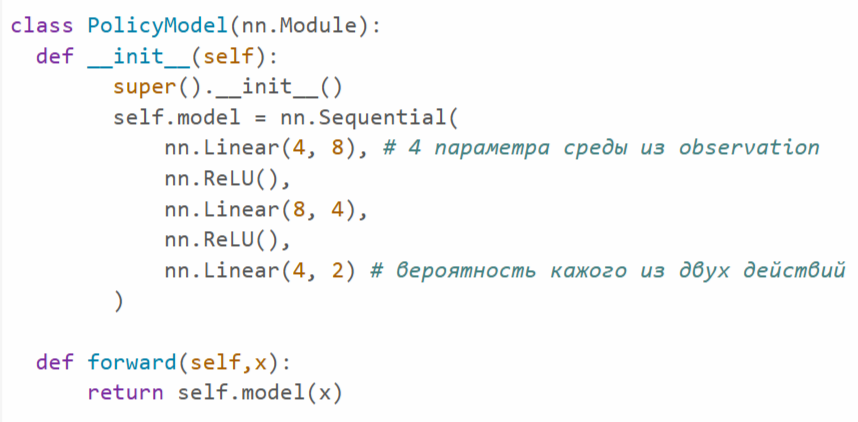

## Алгоритмы RL ##
При обучении алгоритма использовались:
* Vanilla Policy Gradient алгоритм. $loss = -log{\pi (a_t | s_t )} \cdot G_t$
* Policy Gradient with baseline. $loss = -log{\pi (a_t | s_t )} \cdot (G_t- b)$
  *  $Baseline = mean(G_t)$
  *  $Baseline = ValueModel(s_t)$
  *  $Baseline = mean(G_i), i \in [1, ..., t-1, t+1, ...]$

Для начального сравнения каждая из моделей начинала учиться с одинаковым seed и просматривала $5000$ эпизодов, с $learninig \ rate = 10^{-3}$ и $\gamma = 1 - 10^{-2}$:

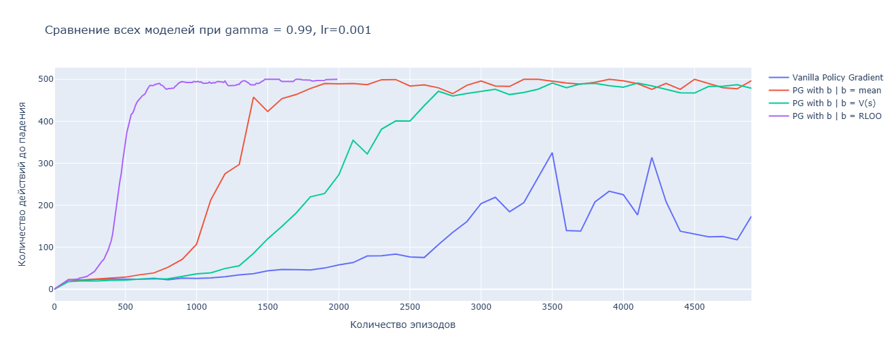
По результатам запуска:
| RL Алгоритм  | Количество эпизода до плато | 
| :-: | :-: | 
| VPG | $-$ |
| PG, b = mean | $3500$ |
| PG, b = ValueModel | $2000$ |
| PG, RLOO | $800$ |

Выводы: обучение на advantage позволяет модели качественнее учиться, обообщая логику получения $s_t -> a_t$. Алгоритм с RLOO оказался с самым сильным, он за меньшее количество шагов выходит на плато и получает среднюю награду больше остальных (почти максимальную).  

### Также были проведены исследования с изменением гиперпараметров и добавлением регуляризации на энтропию ### 

Таблица с результатами добавления энтропии
| VPG  | PG, b = mean | PG, b = ValueModel | PG-RLOO |
| :-: | :-: | :-: | :-: |
| 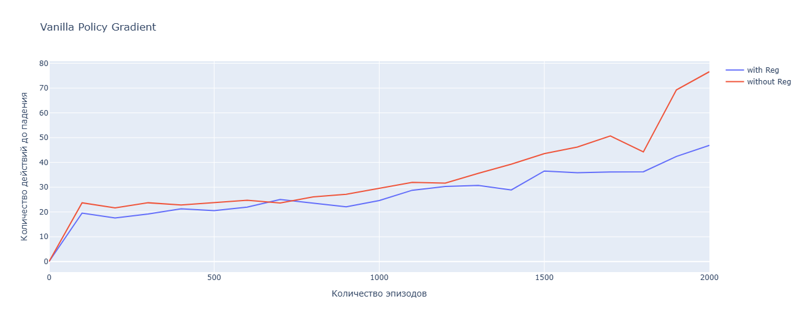 | 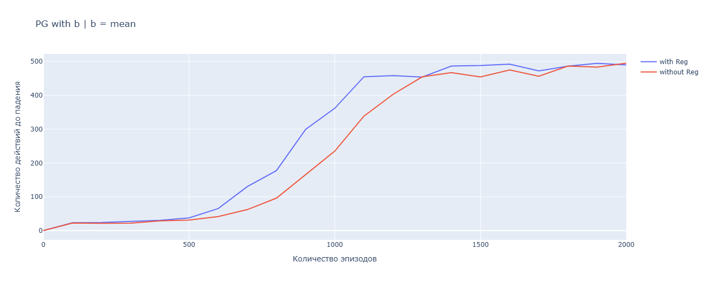 | 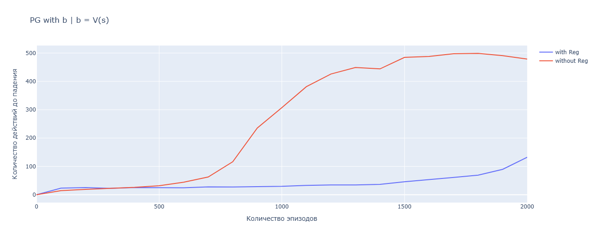 | 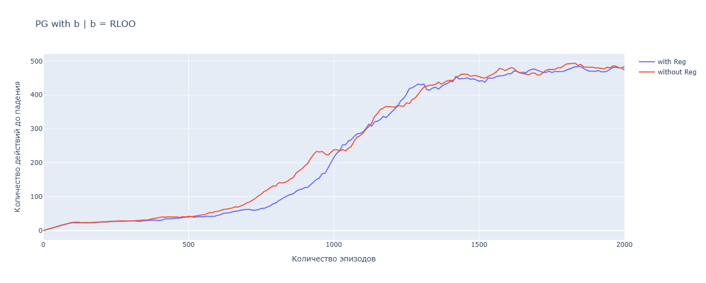 |

Выводы: регуляризация на энтропию может быть полезна в некоторых случаях - для более быстрого опеределения полезных действий, однако иногда она может мешать модели выучить распределение или замедлять этот процесс.

Таблица с изменением $learninig \ rate$
| VPG  | PG, b = mean | PG, b = ValueModel |
| :-: | :-: | :-: | 
| 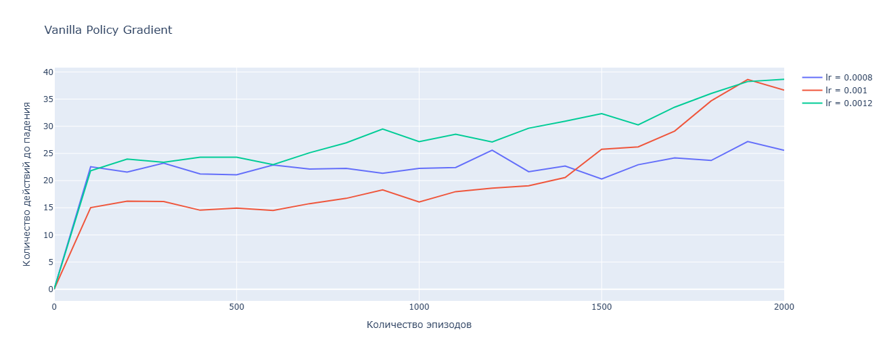 | 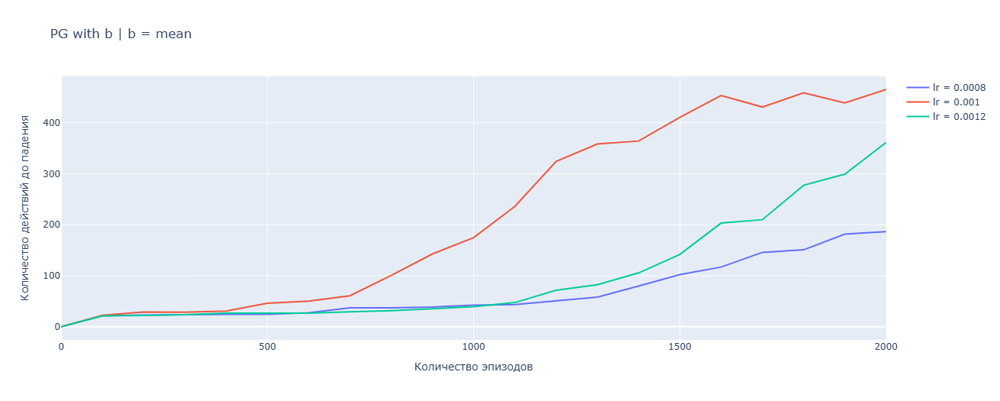 | 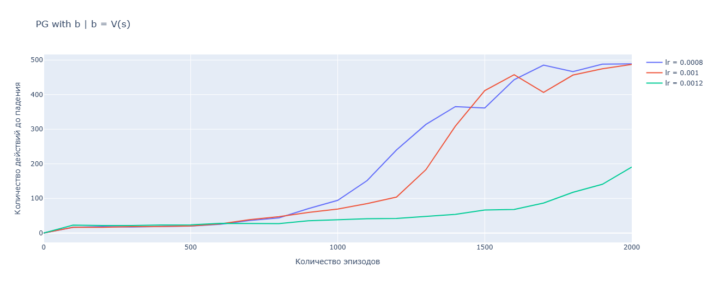 | 

Выводы:  $learninig \ rate = 10^{-3}$ оказался самым стабильным, он позволяет модели обучаться быстро, но при этом он позволяет найти оптмум и не выскочить из него

Таблица с изменением $\gamma$
| VPG  | PG, b = mean | PG, b = ValueModel |
| :-: | :-: | :-: |  
| 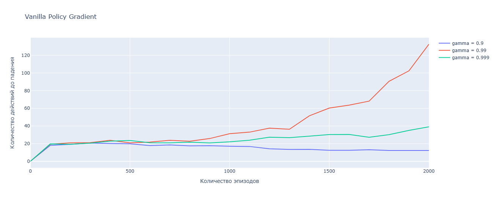 | 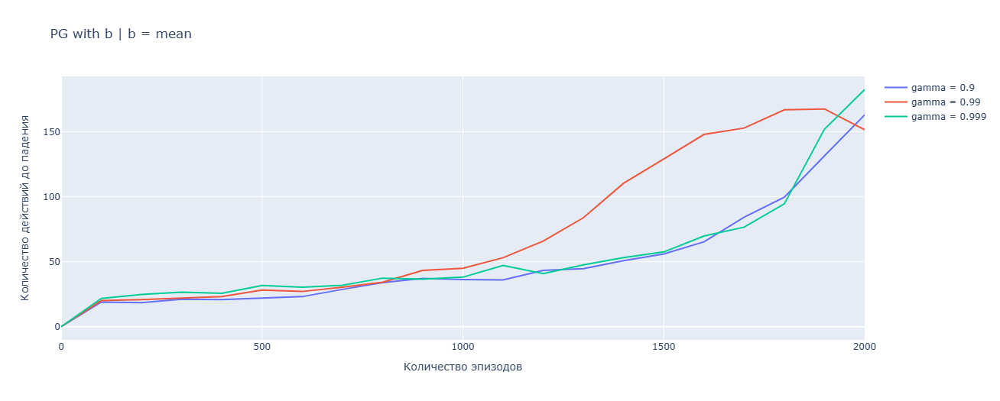 | 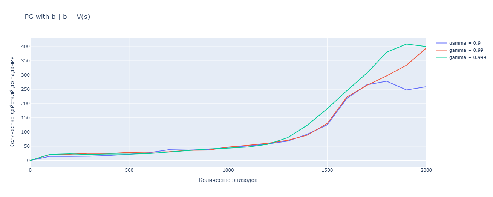 | 

Выводы: $\gamma = 1 - 10^{-2}$ позволяет модели должным образом учитывать последующие награды, не делая их малыми и одновременно не делая их равнозначными с текущей наградой.

## BEHAVIOUR CLONING ##

Для экспериментов BC был взят эксперт - PG-RLOO, обученный на $2000$ эпизодах с разными seed. В среднем expert получает 100% награду на первых 100 действиях. Новая модель была обучена при помощи кросс-энтропии на выводах эксперта о полученном state.

Целю экспериментов было отобразить уязвимость такого алгоритма обучения. Главная уязвимость - при дистиллировании модель сталкивается с меньшим количеством ситауций и получает генерализацию хуже.

После обучения на всех эпизодах без ограничений, модели удавалось выжить в 90% случаев
  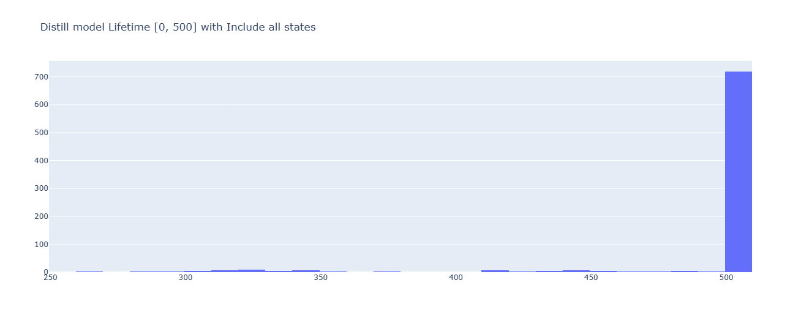

В целях показать уязвимость неполного покрытия пространства возможных событий, было принято решение искусственно ограничить данные в датасете. Не были взяты хвосты распределения параметров среды

Таблица с распределениями

| 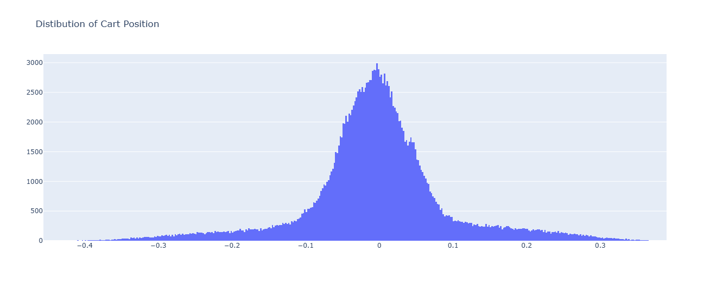 | 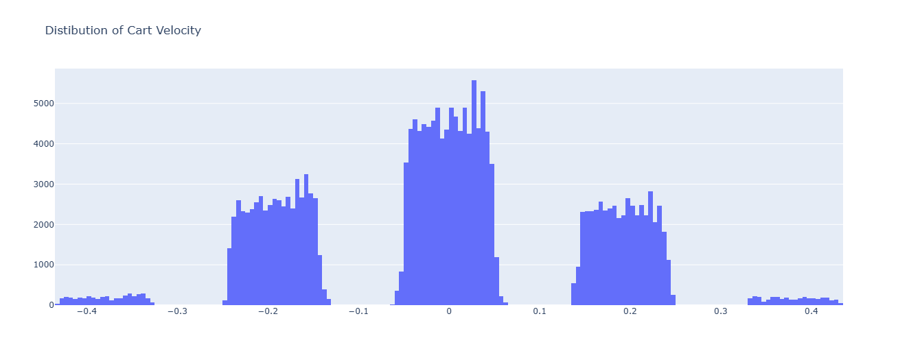 | 
| :-: | :-: |
| 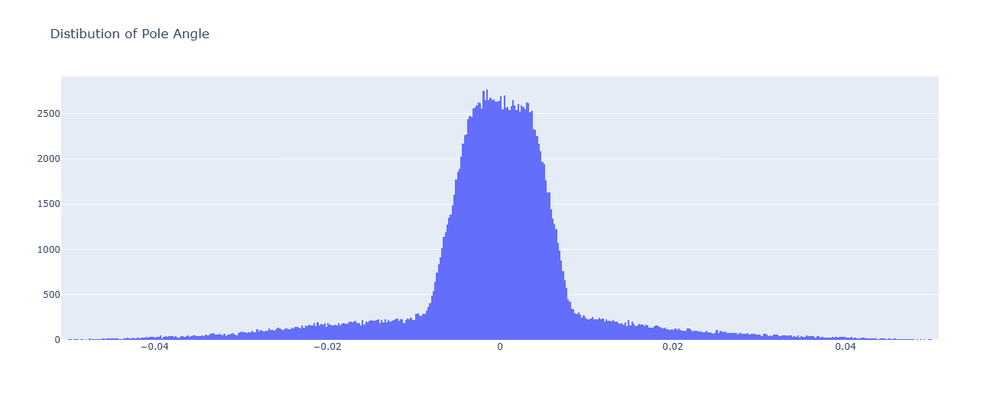 | 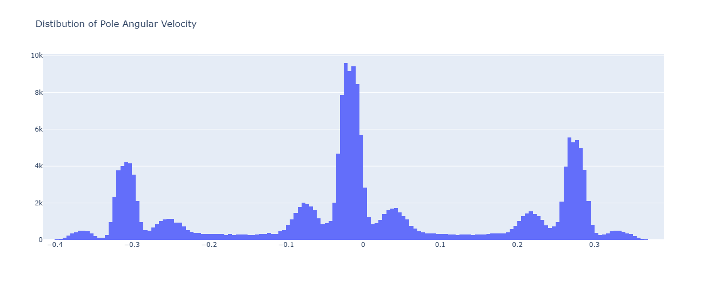 | 

Результаты обучения с ограничениями
| 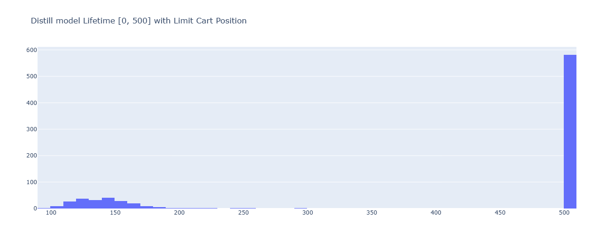 | 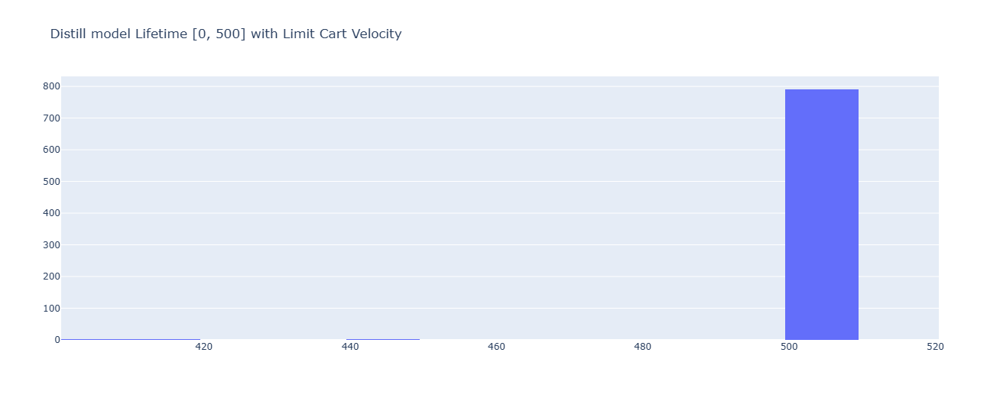 | 
| :-: | :-: |
| 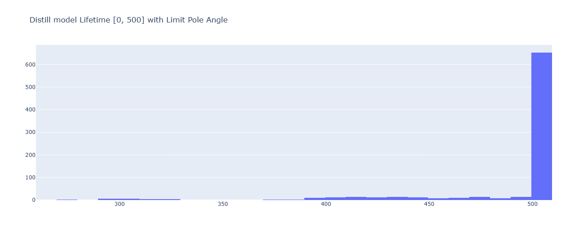 | 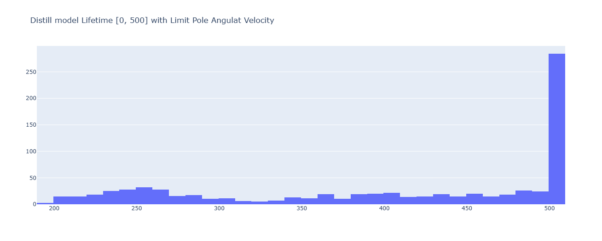 | 

Выводы: если дистиллированная модель не сможет ознакомиться с распределением, то она показывает результаты кратно хуже эксперта. Непокрытые поля не являются равнозначными - ограничения на Cart Position и тем более на Pole Angular Velocity резко ухудшают поведение модели, поскольку выбросы именно в этих параметрах происходят в сложных для модели случаях, когда необходимо удержать шест. Таким образом дистиллированная модель обучается кратно быстрее, но в случаях неполного покрытия распределения входных данных, модель может плохо справляться с задачей генерализации 
